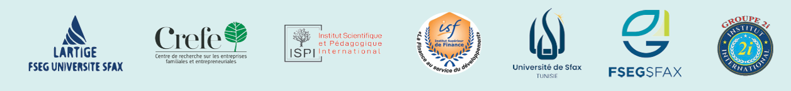

# 🌐 MFC 2025  
## 2ᵉ Colloque International en Management, Finance et Comptabilité  

### **Écosystèmes innovants et maturité digitale : Quels défis et opportunités pour les entreprises familiales et entrepreneuriales ?**

📍 **Hôtel Royal Hammamet, Tunisie**  
📅 **19 – 21 Juin 2025**

---

## 📝 Thématiques du Colloque

- 🌱 **Innovation verte et durabilité**  
- 📊 **Normes IFRS et ESG**  
- 💼 **Gouvernance, éthique et digitalisation**  
- 📈 **Dynamique et stabilité des marchés financiers à l’ère de la digitalisation**  
- 💰 **Enjeux fiscaux à l’ère numérique**  
- 🤖 **Entrepreneuriat responsable, intelligence artificielle et nouvelles pratiques managériales**  
- 📣 **CRM & marketing digital**

---

## 🎯 Objectifs du Colloque

Le **2ᵉ Colloque International de Management, Finance et Comptabilité (MFC 2025)** est organisé par le **Laboratoire de Recherche en Technologie d’Information, Gouvernance et Entrepreneuriat (LARTIGE-FSEGS)**, avec le soutien de :

- Université de Sfax  
- Faculté des Sciences Économiques et de Gestion (FSEGS)  
- Centre de Recherche sur les Entreprises Familiales et Entrepreneuriales (CREFE)  
- Institut Scientifique et Pédagogique International (ISPI)  
- Institut Supérieur de Finance (ISF)

Ce colloque a pour ambition de réunir des chercheurs en sciences de gestion autour des enjeux auxquels font face les entreprises à l’ère de la digitalisation.  
Les innovations technologiques, les bouleversements économiques, les crises récentes, l’évolution des marchés financiers et les nouvelles exigences sociétales imposent une relecture des modèles de création et de répartition de la valeur.

---

## 👩‍🔬 Comité Scientifique

**Membres :**  
Abdelfattah Bouri (FSEG Sfax), Anis Ben Amar (ESC Sfax), Anis Jarboui (ISAA Sfax), Faten Lakhal (EMLV Paris), Ghazi Zouari (FSEG Sfax), Habib Affes (FSEG Sfax), Hamadi Fakhfakh (FSEG Sfax), Hassan Bellihi (ENCG Agadir), Ines Abdelkefi (ESC Sfax), Jamel Chouaibi (FSEG Sfax), Jean-Philippe Gallan (Université de Bordeaux), Jean-Pierre Pichard-Stamford (Université de Bordeaux), Kamel Boussafi (ESC Kolea), Thierry Poulain-Rehm (Université de La Rochelle), Karim Mezghani (FSEGS), Karim Trabelsi (ISAA Sfax), Mohamed Karim Kefi (IDRAC Business School Paris), Mohamed Ouiakoub (Université de Lorraine), Mourad Mroura (IHEC Sfax), Philippe Gillet (Université de Paris-Saclay), Rim Hadiji Zouari (FSEG Sfax), Sonia Zouari (ISAA Sfax), Tijani Amara (ISAA Sfax), Yosra Mnif (ISAA Sfax), Younes Boujelbène (FSEG Sfax)

---

## 🗓️ Dates Importantes

- 📥 **Soumission des papiers :** 30 mars 2025  
- ✉️ **Retour aux auteurs :** 10 avril 2025  
- 📝 **Date limite d’inscription :** 1er mai 2025  
- 📅 **Dates du colloque :** 19 – 20 – 21 juin 2025  

---

## 📚 Publication & Normes de Soumission

### 📝 Critères de sélection des articles

- ✅ Seuls les articles **acceptés et présentés lors du colloque** seront éligibles pour publication.  
- 🏆 Une **sélection des meilleurs articles** sera proposée pour publication dans des **revues scientifiques indexées**.

### 📘 Revues partenaires

- **Revue Management et Avenir**  
- **Revue Vie et Sciences de l’Entreprise**  
- **Revue Management et Sciences Sociales**

📌 Les autres articles validés seront publiés dans les **actes du colloque**, disponibles en formats **papier et numérique (CD-ROM)**.

---

## 📄 Flyer du Colloque

👉 [Télécharger l'affiche (PDF)](Affiche.pdf)

<iframe src="Affiche.pdf" width="100%" height="600px" style="border: none;"></iframe>

---

  

